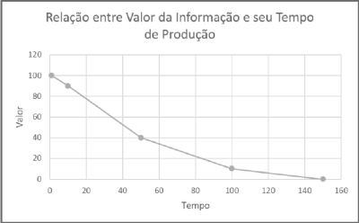

<h1>VISÃO GERENCIAL EM BIG DATA</h1>

A era da informação e conhecimento sempre existiram. Para saber disto basta lembrar de Sócrates 469 a.C, Platão 428 a.C, Aristóteles 384 a.C, entre outros filósofos, matemáticos, físicos, cientitas, escritores, entre outros contribuidores, que contribuiram com milhares de milhares de informações e conhecimentos.

A diferença entre a época dos citados seres humanos e nossa época é que nos últimos 30 anos foram produzidos uma quantidade incomparável de informações e conhecimentos em relação os anteriores últimos 1000 anos, por conta da alta velocidade de propagação

Analisar dados é sobreviver, esta além de ser uma simples atividade

A globalização e competitividade mundial obriga as organizações a serem talentosamente eficientes  na extração de informações e conhecimentos no enorme universo exponencial de dados eletrônicos

O produto do talento eficiente na extração de informações e conhecimento será no mínimo : menos custo, mais vendas, clientes mais satisfeitos, fornecedores mais eficientes, conformidade com órgãos reguladores e conformidade com órgãos fiscalizadores

O PMBOK (2013) define que um projeto é um esforço temporário para produzir um produto ou serviço exclusivo. Um projeto Big Data possui estas mesmas características, e pode gerar resultados por tempo indeterminado.

Um projeto Big Data esta entre os mais complexos e com maiores riscos de todas as indústrias, produzindo algo abstrato, não tangível, envolve muitas estruturas, sistemas, formatos, pessoas e infraestrutura

Um projeto que envolve uma única fonte de dados relacionais para produzir dimensões em um data mart, não pode ser considerado Big Data. 

<h4>ENTENDER PROJETO BIG DATA</h4>

Envolve grandes volumes de dados (petabytes, exabytes, até o infinito), velocidade, variedade, veracidade e valor.

<h4>PROJETO BIG DATA</h4>

Um projeto Big Data envolve muitas fontes de dados, os que envolvem poucas fontes de dados deve haver uma desestruturada ou semi-estruturada ou fontes de dados NoSQL, ou volumes de dados além de um projeto tradicional.

O PMBOK registra que nem todos os processos são obrigatórios. Nem aplicarmos aplica-los com a mesma intensidade. Quais processos usar e intensidade aplicar será responsabilidade do gerente do projeto e sua equipe. Os fatores que envolve são: complexidade, novos elementos relacionados, pessoas, tecnologias, dados de origem ou origem dos dados.

<h4>CRIAR PROTÓTIPOS</h4>

    <ol>
        <li>Baixa complexidade : há experiência prévia e tecnologia madura e testada, talvez seja dispensável um protótipo</li>
        <li>Média complexidade : pouca experiência e com entrega de artefatos de visualização, pode ter protótipos em ferramentas que simulem maquetes de telas</li>
        <li>Grande complexidade : quase sem experiência alguma, pode requerer protótipo funcional para verificar viabilidade e minimizar riscos</li>
    </ol>

<h4>DIFERENÇA ENTRE PROJETO TRADICIONAL DE ANÁLISE DE DADOS E PROJETO BIG DATA</h4>

  <table>
    <tr>
      <th>Características</th>
      <th>Projeto Tradicional</th>
      <th>Projeto Big Data</th>
    </tr>
    <tr>
      <td>Veracidade</td>
      <td>Pode demorar semanas ou meses</td>
      <td>Pode ser milhões de vezes mais rápido, e de forma contínua, e com maior índice de acerto</td>
    </tr>
    <tr>
      <td>Valor</td>
      <td>Pode demorar semanas ou meses, para ter certeza se o resultado é positivo ou negativo</td>
      <td>Provavelmente em algumas horas saiba se o resultado é positivo ou negativo</td>
    </tr>
    <tr>
      <td>Velocidade</td>
      <td>Auditoria manual, por amostragem, pode demandar semanas ou meses, definido período para executar</td>
      <td>Com computador o processo é quase todo eletrônico, o mínimo de erro, milhões de vezes mais rápido, e de forma contínua</td>
    </tr>
    <tr>
      <td>Volume</td>
      <td>Construídos em data warehouse, contendo até terabytes de dados</td>
      <td>Construídos em data warehouse e/ou nuvem, a partir de petabyte de dados</td>
    </tr>
    <tr>
      <td>Variedade</td>
      <td>Dados relacionais estruturados, hieráquico ou de rede</td>
      <td>Além do tradicional, incluem dados não estruturados, semi-estruturados : redes sociais, sensores, web, documentos, emails, etc, etc...</td>
    </tr>
    <tr>
      <td>Arquitetura</td>
      <td>Projeto Centralizado em um servidor</td>
      <td>Projeto Distribuído entre servidores</td>
    </tr>
    <tr>
      <td>Crescimento</td>
      <td>Vertical : +memória, +cpu, +servidor</td>
      <td>Horizontal : adicionados data nodes</td>
    </tr>
    <tr>
      <td>Virtualizados</td>
      <td>Normalmente não</td>
      <td>Geralmente Sim</td>
    </tr>
    <tr>
      <td>Tráfego de dados</td>
      <td>Mais dados do servidor ao cliente ou do servidor para fora da empresas</td>
      <td>O maior tráfego é entre os nós dos servidores</td>
    </tr>
    <tr>
      <td>Carga de dados</td>
      <td>Normalmente é realizado após pré-análise e identificação de valor agregado. Os dados são tratados e carregados em repositórios pequenos (para padrões Big Data), para apoiar decisões.</td>
      <td>Geralmente carregam grandes volumes (a partir de petabytes) de dados em um sistema HDFS -Hadoop Distributed File System ou para Serviços Cloud, mesmo sem identificar informação com valor agregado. O nome dado a formação de dados é data lakes (lago de dados). Posteriormente parte destes dados podem ser tranferidos a um tradidional data mart</td>
    </tr>
  </table>

O gráfico a seguir mostra a relação inversa entre tempo de produção da informação e o valor da informação

<picture>
    
</picture>
 
<h4>DIFERENÇAS NA ESTRUTURA BÁSICA DE SOLUÇÃO DE ANÁLISE DE DADOS</h4>

  <table>
    <tr>
      <th>Elementos</th>
      <th>Análise Tradicional de Dados</th>
      <th>Análise de Big Data</th>
    </tr>
    <tr>
      <td>Fontes de dados</td>
      <td>Normalmente dados relacionais estruturados, hieráquico ou de rede. Alguns casos não estruturados</td>
      <td>Estruturados e não estruturados com enorme quantidade de variedades de fontes de dados</td>
    </tr>
    <tr>
      <td>Carga</td>
      <td>Realizado por um processo de carga, web service ou uma API</td>
      <td>Realizado por um processo de carga, web service ou uma API</td>
    </tr>
    <tr>
      <td>Armazenamento</td>
      <td>Em um banco de dados relacional ou dimensional</td>
      <td>Em sistemas de arquivos distribuídos com HDFS e em bancos de dados NoSQL</td>
    </tr>
    <tr>
      <td>Análise</td>
      <td>Utilizar consultas em linguagem estruturada (Pig Latin ou SQL) ou algorítimo machine learning (aprendizado de máquina) utilizando cubos de decisão</td>
      <td>Utilizar consultas em linguagem estruturada (Pig Latin ou SQL) ou algorítimo machine learning (aprendizado de máquina) utilizam map reduce</td>
    </tr>
    <tr>
      <td>Visualização</td>
      <td>Painéis, relatórios, KPIs, entre outros</td>
      <td>Painéis, relatórios, KPIs, entre outros</td>
    </tr>
  </table>

<h4>OBJETIVO DO PROJETO BIG DATA</h4>

Projetos big data são altamente complexos e envolvem grande número de variáveis, para alcançar seu objetivo que é : Responder Perguntas.

Agrupando todos os elementos envolvidos para alcançar o objetivo, um projeto big data envolve : pessoas, processos, dados e tecnologia. A seguir o Triângulo dos projetos Big Data :

  <table>
    <tr>
      <th>Elementos</th>
      <th>Objetivo do elemento</th>
    </tr>
    <tr>
      <td>Pessoa</td>
      <td>É o elemento mais importante do Big Data, por que os projetos Big Data são feitos por pessoas para pessoas envolvidas no processo. As pessoas que produzem : dados de origem, configuram sistemas de processamento, programam scripts, definem regras de negócios, fornecem suporte, interpretam legislação, geram relatórios, parametrizam KPIs, definem requisitos técnicos e funcionais das soluções, entre outros</td>
    </tr>
    <tr>
      <td>Processo</td>
      <td>Definem os requisitos funcionais do projeto. São definidos por pessoas, normas internas, necessiddes gerenciais, legislação, conformidade ou regras de mercado</td>
    </tr>
    <tr>
      <td>Dado</td>
      <td>É a Matéria-prima que será analisada, tratada e adequada a realidade do negócio, tornado-se qualificada aos objetivos do projeto, e ainda será processado por um ou mais algoritmos matemáticos, estatísticos e/ou relacionais em que o usuário final será capaz de extrair informações e conhecimento.</td>
    </tr>
    <tr>
      <td>Tecnologia</td>
      <td>São conectores, softwares de extração, softwares de transformação, softwares de qualidade de dados, algoritmos de aprendizado de máquina, softwares de visualização, discos rígidos, clusters, roteadores, switches, banco de dados, redes, internet, website, webapp, etc...</td>
    </tr>
  </table>

<h4>PROJETO COM FOCO NO NEGÓCIO</h4>

  <ol>
    <li>Trazer vantagem competitiva ao resolver um problema de negócio para vender mais, gastar menos, ser mais eficiente, ser mais eficaz, entre outros benefícios</li>
    <li>Desenvolver produto ou serviço que oferece solução à valorizar os dados como : mecanismo de buscas, um serviço de previsão de preços de passagens áreas, um BI self-service, etc</li>
  </ol>

<h4>PROJETO COM FOCO NOS OBJETIVOS</h4>

  <ol>
    <li>Negócios : considere projeto com foco no negócio</li>
    <li>Auditoria : encontrar fraudes, desperdícios, vírus, spams, e/ou erros</li>
    <li>Conformidade : atender uma ou mais normas específicas, associada a alguma entidade reguladora ou fiscalizadora. Ex : eSocial, secção 404 da Sarbanes-Oxley</li>
    <li>Operação : atender requisitos operacionais. Ex : controle de linha de produção, Controle Estatísticos de Processos, monitoramento de sitema de informação, etc...</li>
    <li>Pesquisa : qualquer projeto de pesquisa em qualquer área. Exemplo: GIMPS-Great Internet Mersenne Prime Search</li>
  </ol>

<h4>PROJETO COM FOCO NAS ANÁLISES</h4>

  <ol>
    <li>Descritivos ou Exploratórios : analisar dados para conhecê-los ou apresentar resultados consolidados. Ex : vendas por tipo de produto ou funcionários por departamento. Forte na produção de gráficos de dispersão, diagrama de caixa, setores, barras, etc</li>
    <li>Inferência: apresentar prováveis fatos a partir de uma parte menor da população de dados, com uma margem de erro</li>
    <li>Análiticos : buscar relações entre diversos dados. Ex : vendas de acordo com o sexo do cliente, absenteismo de acordo com o cargo do funcionário</li>
    <li>Preditivos : prever fatos futuros, com base em fatos ocorridos. Ex : prever bom pagador, aluno com melhor desempenho, tempo que um funcionário ficará na empresa, etc</li>
    <li>Prescritivos : trazer informações que permita mudar evento futuro. Ex : ações para funcionário permanecer na empresa</li>
  </ol>

<h4>PROJETO COM FOCO NA FONTE DE DADOS</h4>

  <ol>
    <li>modelo : relacional, rede, hireráquico, orientado a objetos, chave-valor, dimensional, etc</li>
    <li>fornecedor : Aws Amazon, Oracle, Dell, Sbt Televisão, IBM</li>
    <li>origem : sistemas de produção, midias sociais, pesquisas, benchmarking, sensores, etc</li> 
    
Estes dados podem ser :

    

      <ol>
        <li>estruturados : estrutura rígida e fixa de dados organizados em linha e em colunas. Ex : planilhas , banco de dados relacionais</li>
        <li>semi-estruturados : não é homogênea e não é fixa. Ex : XML e json</li>
        <li>não estruturados : sem qualquer tipo de estrutura definida. Ex : documentos, e-mails, sites, etc</li>
      </ol>
    

  </ol>

<h4>VALOR DE NEGÓCIO</h4>

O gerente de projetos aceita o Business Case amplamente discutido, analisado e aprovado, e trabalha para garantir o seu sucesso aplicando as seguintes técnicas :

  <ol>
    <li>seguir os critérios de sucesso</li>
    <li>seguir os fatores de sucesso</li>
    <li>controle sobre o o projeto</li>
  </ol>

<h4>CRITÉRIOS DE SUCESSO DE PROJETOS BIG DATA</h4>

Usados para medir se o projeto foi bem-sucedido. Podem ser os mais diversos, vejamos a seguir alguns dos mais comuns :

  <ol>
    <li>Usuários satisfeitos</li>
    <li>Patrocinadores satisfeitos</li>
    <li>Aumento de vendas</li>
    <li>Redução de fraudes</li>
    <li>Redução do custo operacional</li>
    <li>Disponibilidade</li>
    <li>TCO</li>
  </ol>

<h4>FATORES DE SUCESSO</h4>

A seguir os fatores que o gerente de projeto e sua equipe devem observar para aumentar as chances do projeto ser bem-sucedido :

  <ol>
    <li>Suporte do patrocinador : é fundamental que acredite no projeto, esteja interessado e o priorize</li>
    <li>Envolvimento dos interessados : os interessados devem ser envolvidos e saber que teem valor no projeto</li>
    <li>Metas do projeto :
      <ol>
        <li>Entrega com mínima variação de prazo</li>
        <li>Com escopo acordado</li>
        <li>Com custos previsto</li>
        <li>Com valor de negócio</li>
      </ol>
    </li>
    <li>Orientado a negócio : avaliar o que quer produzir, qual o seu objetivo.
    </li>
    <li>Sub-Orientado a tecnologia : avaliar as tecnologias existentes.
    </li>
     
  </ol>

<h4>VOLUME E CRESCIMENTO</h4>

Analisar com a equipe do projeto e o pessoal da infraestrutura a respostas as seguintes perguntas :

  <ol>
    <li>Qual será o volume de dados ?</li>
    <li>Quantas serão as transações por minuto ?</li>
    <li>Qual volume de dados diário e mensal em terabytes, petabytes ?</li>
    <li>Quantos datanodes e namenodes são necessários ?</li>
    <li>Qual estimativa de volume para os próximos 3 três anos ?</li>
  </ol>

 - 

 - 

 - 

 - 

<a href="https://www.youtube.com/watch?v=B-JmU842t_Q">A HISTÓRIA DA INFORMAÇÃO Documentário 2012</a> 
<a href="https://www.youtube.com/watch?v=eOrpDa0BH1c">Consumo de informação | Ricardo Cappra, para PUCRS Online</a>
 

 - 

 - 

 - 

 - 

 - 

 - 

 - 

 - 

 - 

